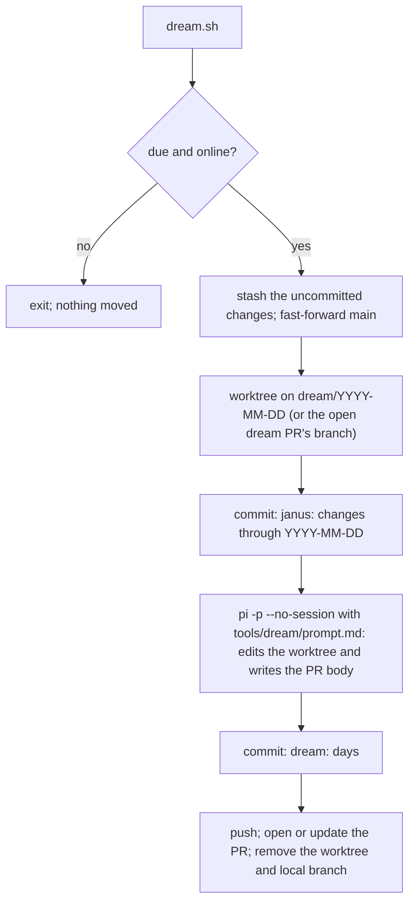

# Dream

Dream is Janus's nightly consolidation. During the day Janus records what it notices at the moment: decision lines, ticket checkpoints, project updates, root notes. Some things only show up across a whole day: a preference stated in passing, the same correction made twice, a plan that does not match how Greyy actually works, a root note that never got promoted. Dream reads the day back and brings Janus's state up to date, then hands every change to Greyy as one pull request.

The instructions Janus follows during a run are the prompt `tools/dream/prompt.md`. This document explains the setup around it.

## When it runs

- **03:00 local, by launchd.** `pnpm dream:install` installs the job for this checkout. On a Mac that was asleep at 03:00, launchd runs it on wake.
- **Offline:** the run checks GitHub first and exits without touching anything when the network is down. launchd cannot wait for a network.
- **Catch-up before the next prompt.** The `.pi/extensions/dream` extension runs `tools/dream/dream.sh catch-up` before each of Greyy's prompts. It returns at once when no dream is due. When one is due, it moves the changes (a few seconds), then lets the model part run in the background.

A day is due once it is past 03:00 the next morning and `.janus/dream/last`, the last day dreamed, is older. One run covers every day since the last dream.

## Inputs

| Input | What it is | Weight |
| --- | --- | --- |
| Uncommitted changes in the Janus checkout | What Janus and Greyy recorded at the time | Highest |
| Root notes | What Greyy chose to write down | Intentional, unverified |
| Janus conversations | `pnpm brain:sessions` and `pnpm brain:transcript` | Observed |

Coordinate mode is excluded: `/coordinate` marks the transcript, and the session tools ignore everything after the mark. Its decisions already reach Dream as decision lines and project updates in the changed files. Coordinator sessions run in `coordinator/` and are never listed.

## How a run works

- **Moving, not copying.** The main checkout ends up clean, and the changes come back through the PR. Copying would leave root notes behind, and the next dream would digest them again. Until Greyy merges the PR, sessions do not see those changes; the next dream fast-forwards `main` after a merge.
- **One open dream PR at a time.** While it is open, later dreams add commits to its branch and rewrite its body to cover every day.
- **Its own session is not saved.** The run uses `pi --no-session`, so Dream never reads its own transcript.

## What it changes

Through the skills that own each record: tickets, projects, decision lines, precedents, grants, and `brain/Working Model.md`, the page of Janus's beliefs about how Greyy works. Every root note leaves the root: promoted and archived, archived, or deleted.

Merging is approval. Anything a skill would normally propose and wait for, such as a precedent's wording, goes into the PR under **Needs your judgment**. The PR body describes every change, why, and its evidence, so it can be judged without opening files.

## The prompt

`tools/dream/prompt.md` is the whole instruction set: what to read, what to look for, where each finding goes, how to digest root notes, and the PR body format. The runner fills in `{{days}}`, `{{root}}`, `{{changes_commit}}`, `{{pr_body}}`, and `{{previous_pr_body}}` (`none` when no dream PR is open), then passes it to `pi -p`.

To try a variant, keep a copy in `.janus/dream/prompts/` (gitignored), edit it, and run `pnpm dream --prompt .janus/dream/prompts/<name>.md`. The runner reads the file before moving the changes. A variant anywhere else in the checkout is an uncommitted change like any other: it moves into the PR, and in the root Dream would digest it as a note. The PR body ends with the prompt file it was written with, so variants can be compared PR by PR. Scheduled runs and the catch-up always use `tools/dream/prompt.md`.

## Authority

Dream acts under `Dream commits and opens its PR (G-001)` in `brain/Grants.md`: it may commit in its worktree, push `dream/*` branches, and open or update the dream PR. It never merges or pushes to `main`.

## Failures

| Failure | What happens |
| --- | --- |
| Offline | Nothing moves; the next catch-up retries |
| Checkout not on `main` | Nothing moves; reported |
| The changes conflict with the open dream PR | The changes go back to the checkout; reported; merge or close the PR first |
| The model run fails, writes no PR body, or the push fails | Dream's edits are dropped, the changes go back to the checkout; reported |
| Pushed, but the PR could not be opened or updated | The day counts as dreamed; the message gives the `gh` command to finish |

A failure during a catch-up shows at once. A failure at 03:00 or in the background shows before Greyy's next prompt. Details are in `.janus/dream/dream.log`.
