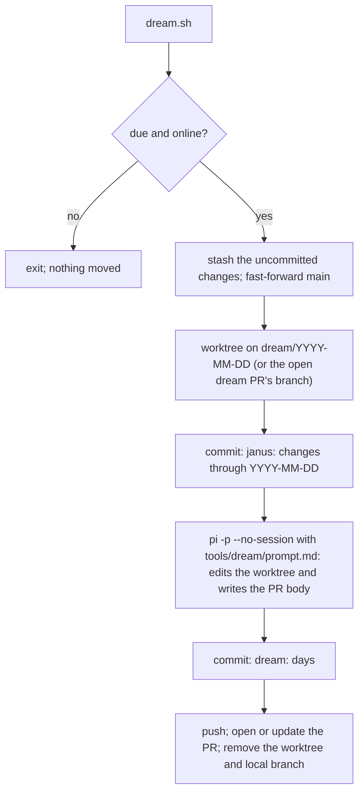

# Dream

Dream is Janus's nightly consolidation. During the day Janus records what it notices at the moment: decision lines, ticket checkpoints, project updates, root notes. Some things only show up across a whole day: a preference stated in passing, the same correction made twice, a plan that does not match how the user actually works, a root note that never got promoted. Dream reads the day back and brings Janus's state up to date, then hands every change to the user as one pull request.

The instructions Janus follows during a run are the prompt `tools/dream/prompt.md`. This document explains the setup around it.

## When it runs

- **03:00 local, by launchd.** `pnpm dream:install` installs the job for this checkout. On a Mac that was asleep at 03:00, launchd runs it on wake.
- **Offline:** the run checks GitHub first and exits without touching anything when the network is down. launchd cannot wait for a network.
- **Catch-up before the next prompt.** The `.pi/extensions/dream` extension runs `tools/dream/dream.sh catch-up` before each of the user's prompts. It returns at once when no dream is due. When one is due, it moves the changes (a few seconds), then lets the model part run in the background.

A day is due once it is past 03:00 the next morning and `.janus/dream/last`, the last day dreamed, is older. One run covers every day since the last dream.

## Inputs

Before the model starts, the runner gathers every input into one Markdown file with `pnpm dream:input` and gives the model its path:

| Input | What it is |
| --- | --- |
| Uncommitted changes | The commit holding them, as stat and patch: what Janus and the user recorded at the time |
| Root notes | Each note in the root with its content; notes kept earlier and unchanged are only named |
| Janus conversations | Every session of the days, rendered like `pnpm brain:transcript`, with its path |
| Earlier sightings | `## Noticed, not changed` from dream PRs of the previous 30 days |

Run `pnpm dream:input` yourself to see what Dream would read. Which input wins depends on the question; see What it changes.

Coordinate mode is excluded: `/coordinate` marks the transcript, and the session tools ignore everything after the mark. Its decisions already reach Dream as decision lines and project updates in the changed files. Coordinator sessions run in `coordinator/` and are never listed.

## How a run works

- **Moving, not copying.** The main checkout ends up clean, and the changes come back through the PR. Copying would leave root notes behind, and the next dream would digest them again. Until the user merges the PR, sessions do not see those changes; the next dream fast-forwards `main` after a merge.
- **One open dream PR at a time.** While it is open, later dreams add commits to its branch and rewrite its body to cover every day.
- **Its own session is not saved.** The run uses `pi --no-session`, so Dream never reads its own transcript.

## What it changes

Through the skills that own each record: tickets, projects, decision lines, precedents, grants, and `brain/Working Model.md`, the page of Janus's beliefs about how the user works. Which evidence wins depends on the question: the user's own turns for what they want (the later explicit statement wins), the source repository for how code behaves, and the canonical Markdown for Janus's recorded state unless stronger evidence shows it was recorded wrongly.

A working-model belief needs the user's explicit statement, or the same behaviour seen again under similar conditions. A single observation goes under **Noticed, not changed** in the PR body. Later dreams read those sections from the dream PRs of the previous 30 days to find repetitions, so the PR history is the record of earlier sightings; nothing else is stored.

Every root note is considered, but not every note is resolved: Dream promotes and archives it, archives it, deletes it, or keeps it unresolved. A kept note goes back to the root, stays out of the PR, and is listed with its SHA-1 in `.janus/dream/kept`; later dreams leave it out until the user changes it.

Merging is approval. When a skill would normally propose and wait for the user, such as a precedent's wording, Dream writes the exact change on its branch and lists it under **Needs your judgment**. It stays non-canonical until the merge, and closing the PR rejects it. Dream never records approval as given: a precedent says `approved: by merging dream PR <branch>`, which only becomes true on `main`. The PR body describes every change, why, and its evidence, so it can be judged without opening files.

## The prompt

`tools/dream/prompt.md` is the whole instruction set: which evidence wins, what to look for, where each finding goes, how to handle root notes, and the PR body format. The runner fills in `{{days}}`, `{{root}}`, `{{input}}`, `{{changes_commit}}`, `{{branch}}`, `{{pr_body}}`, `{{kept_notes}}`, and `{{previous_pr_body}}` (`none` when no dream PR is open), then passes it to `pi -p`.

To try a variant, keep a copy in `.janus/dream/prompts/` (gitignored) and edit it. A variant anywhere else in the checkout is an uncommitted change like any other: a real run moves it into the PR, and in the root Dream would digest it as a note.

Compare variants with dry runs: `pnpm dream --dry-run --prompt .janus/dream/prompts/<name>.md` (omit `--prompt` for the default). A dry run dreams the latest day on a throwaway worktree holding a copy of the uncommitted changes and writes `input.md`, `pr-body.md`, `kept-notes.txt`, and `dream.diff` (Dream's edits) to `.janus/dream/dry-run/<time>-<prompt>/`. It leaves the checkout, `.janus/dream/last`, and GitHub untouched, so every variant can run against the same day.

A real run with `pnpm dream --prompt <path>` behaves like the 03:00 run with that prompt, and its PR body ends with the prompt file. Scheduled runs and the catch-up always use `tools/dream/prompt.md`.

## Authority

Dream acts under `Dream commits and opens its PR (G-001)` in `brain/Grants.md`: it may commit in its worktree, push `dream/*` branches, and open or update the dream PR. It never merges or pushes to `main`.

## Failures

| Failure | What happens |
| --- | --- |
| Offline | Nothing moves; the next catch-up retries |
| Checkout not on `main` | Nothing moves; reported |
| The changes conflict with the open dream PR | The changes go back to the checkout; reported; merge or close the PR first |
| The model run fails, writes no PR body, or the push fails | Dream's edits are dropped, the changes go back to the checkout; reported |
| Pushed, but the PR could not be opened or updated | The day counts as dreamed; the message gives the `gh` command to finish |

A failure during a catch-up shows at once. A failure at 03:00 or in the background shows before the user's next prompt. Details are in `.janus/dream/dream.log`.
